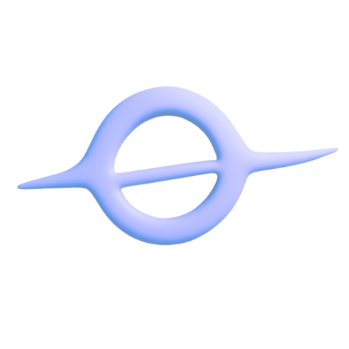

# ERGO | Proyecto Open Source | '*Wikipedia*' STEM Colaborativa

ERGO es una plataforma de notas y apuntes colaborativos para estudiantes STEM. 
El objetivo es centralizar el conocimiento e información en común de una clase o materia en particular, facilitar el acceso a material de estudio a través de una infraestructura gratuita, y fomentar la colaboración entre estudiantes. 
Para *FAMAF* y quién sabe dónde más.
****
## **Características Principales**
* **Contenido Curado:** Sección "Oficial" con material revisado por administradores.
* **Comunidad Abierta:** Cualquier estudiante puede subir sus propios apuntes o ejercicios resueltos.
* **Editor Web Integrado:** No necesitás saber Git para colaborar. Podés usar nuestro panel de **Decap CMS** para escribir desde el navegador.
* **Soporte LaTeX:** Renderizado impecable de fórmulas matemáticas mediante KaTeX/MathJax.
* **Feedback Directo:** Comentarios en cada página para correcciones o sugerencias.
---
### Para usuarios
Podés acceder a la versión publicada del sitio aquí:  

👉 **[https://ergonotes.github.io/MD1-FAMAF-UNC/](https://ergonotes.github.io/MD1-FAMAF-UNC/)**

---
## **Estructura del Proyecto**
* `docs/`: Contenido (notas o apuntes) en formato Markdown, organizado por secciones.
* `docs/oficial/`: Contenido validado previamente por CODEOWNERS y estructurado.
* `docs/comunidad/`: Apuntes libres, resúmenes y ejercicios. También pudiendo seguir una estructura.
* `docs/(comunidad u oficial)/assets`: Imágenes, capturas de pantalla y contenido en notas.
* `docs/admin/`: Configuración para el editor web Decap CMS.
* `hooks.py`: Lógica de procesamiento de Markdown y configuración dinámica del CMS.
* `overrides`: Archivos de sobreescritura para personalizar la apariencia y el comportamiento del sitio.
* `mkdocs.yml`: Configuración del sitio, bajo el framework MkDocs.
* `.github/workflows`: Flujo de trabajo para la automatización de tareas.
---

### Para colaboradores
¿Querés sumar tu apunte?
> 💡 Consultá la **[Guía de Contribución](docs/contribution-guide.md)** para conocer los detalles técnicos (uso de carpetas, previsualización de fórmulas, etc).

---
## **Licenciamiento (Híbrido)**

Este proyecto protege tanto la libertad del código como la autoría del contenido:
1.  **Código Fuente:** Licenciado bajo **[GNU AGPLv3](LICENSE)**. Si usás o mejorás esta infraestructura para tu propio sitio, estás obligado a mantenerlo abierto.
2.  **Contenido (Apuntes):** Todo el material de estudio se distribuye bajo **[CC BY-NC-SA 4.0](https://creativecommons.org/licenses/by-nc-sa/4.0/)** (Atribución - No Comercial - Compartir Igual).
---
## **Apoyo y Mejoras**
Este sitio se mantiene gracias al esfuerzo del desarrollador. Si te sirve el material, podés ayudar de varias formas:
* **Desarrollo:** Reportando bugs o mejorando cualquier aspecto del código actual, o del que se está desarrollando para la próxima versión.
* **Contenido:** Corrigiendo errores de tipeo en las fórmulas o subiendo nuevos finales resueltos.
* **Sustento:** El proyecto se mantiene gracias al esfuerzo del desarrollador, y cualquier apoyo para mejorar la infraestructura es muy apreciado. El desarrollador tiene intenciones de ser totalmente transparente con la cifra y uso de los fondos que puedan llegar a través de donaciones, y se compromete a reinvertirlos en mejoras para el proyecto. Si querés apoyar, podés hacerlo a través de [Cafecito](https://cafecito.app/ergonotes)

---
*Creado por [tomasccc](https://github.com/tomasccc).*
